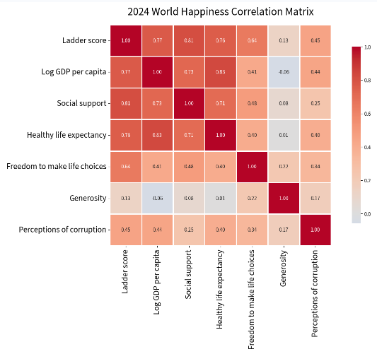
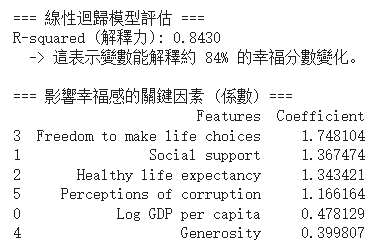
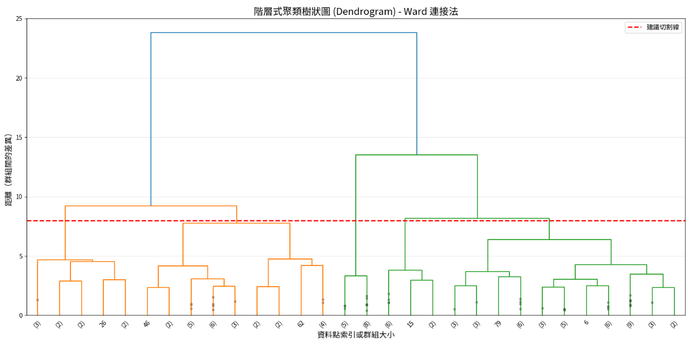
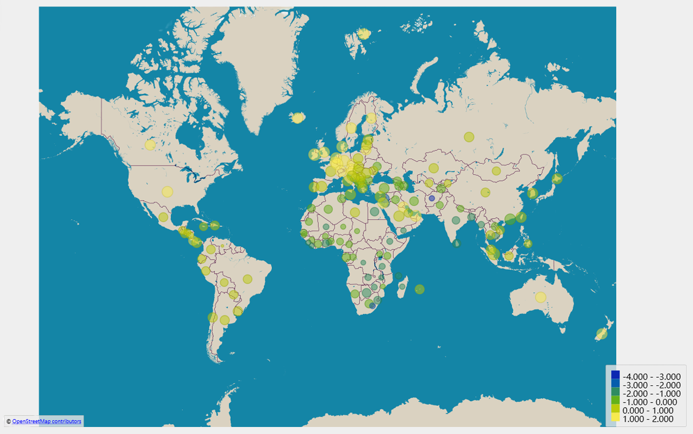

# World Happiness ML Analysis (2024)

本專案旨在透過 2024 年世界幸福報告數據，探討影響全球國家幸福感的關鍵因素，並運用機器學習技術進行預測與國家分群進行觀察。

## 📌 專案簡介
幸福感究竟是由什麼決定的？本研究分析了人均 GDP、社會支持、健康預期壽命、自由度、慷慨程度及政治治理等六大變數，試圖量化國家間的幸福差異。

## 📊 數據分析與視覺化

### 1. 數據特徵概覽
### 1. 資料集變數摘要 (Data Overview)
本專案分析 2024 年世界幸福報告之 7 大核心變數，數據摘要如下：

| 變數名稱 | 定義 | 數據性質 |
| :--- | :--- | :--- |
| **Ladder score** | 幸福指數分數 | 目標變數 |
| **GDP per capita** | 人均 GDP | 經濟指標 |
| **Social support** | 社會支持網絡 | 社會指標 |
| **Healthy life expectancy** | 健康預期壽命 | 健康指標 |
| **Freedom** | 生活選擇自由度 | 制度指標 |
| **Generosity** | 慷慨程度 | 文化指標 |
| **Perceptions of corruption** | 政治貪腐感知 | 治理指標 |

### 2. 特徵相關性熱圖 (Heatmap)
分析幸福指數與各個變數之間的相關性，社會支持與 GDP 顯示出高度相關。


### 3. 線性迴歸預測模型
運用線性迴歸 (Linear Regression) 建立預測模型，模型 R² 達到 0.843，具備良好的解釋能力。


### 4. PCA 主成分分析與 K-Means 分群
運用 PCA 降維後進行 K-Means 分群，成功將國家分為「發展中奮鬥」、「生存挑戰」與「幸福繁榮」三大類。


### 5. 階層式聚類樹狀圖 (Dendrogram)
透過樹狀圖驗證不同分群方法的一致性。


### 6. 全球幸福指數地理分布
視覺化呈現全球各國的幸福指數現況。


## 🚀 專案結構
```text
.
├── data/                       # 存放原始資料集 (CSV)
│   └── World-happiness-report-2024.csv
├── figures/                    # 存放分析產出的視覺化圖表
├── world_happiness_ml_analysis.ipynb  # 核心 Jupyter Notebook 程式碼
└── README.md                   # 專案說明文件
