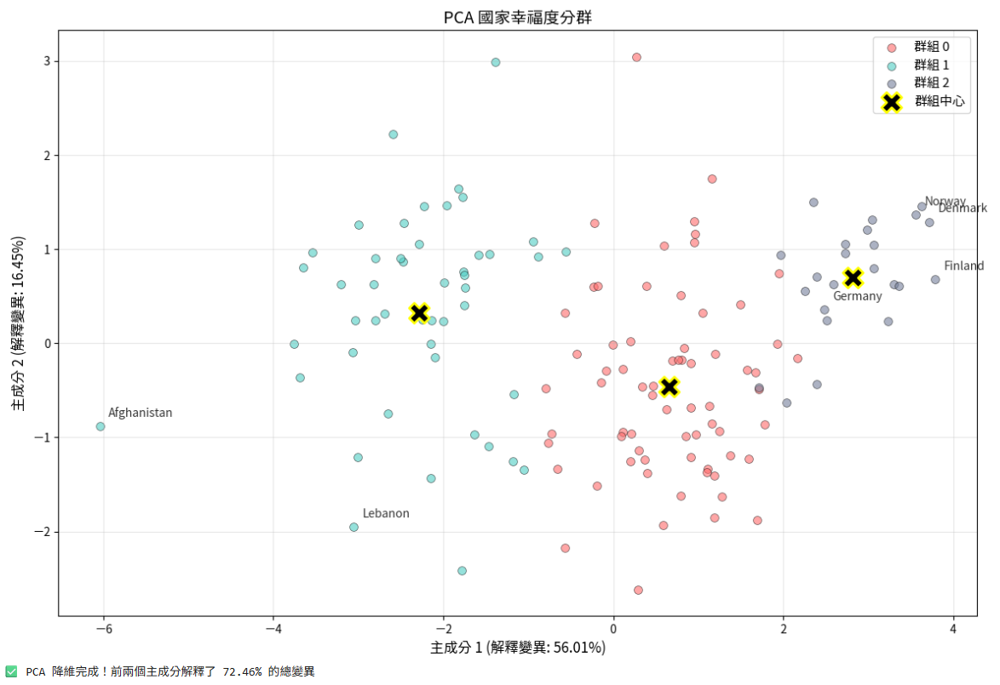

# 世界幸福指數分析 World Happiness ML Analysis (2024)

本專案旨在透過 2024 年世界幸福報告數據，探討影響全球國家幸福感的關鍵因素，並運用監督式與非監督式機器學習技術進行預測與國家發展特徵分群，進行觀察與分析。

---

## 📌 研究動機與資料架構 (Motivation & Data Framework)
* **研究目的**：幸福感究竟是由什麼決定的？本研究旨在量化人均 GDP、社會支持等主客觀指標，解構全球國家間的幸福感差異，並根據觀察結果提出結論與政策建議。
* **資料來源與摘要**：整合 2024 年世界幸福報告（World Happiness Report），涵蓋全球 140 餘國之跨國社會經濟指標。本專案核心分析之 7 大變數摘要如下：

| 變數名稱 | 定義 | 數據性質 |
| :--- | :--- | :--- |
| **Ladder score** | 幸福指數分數 | 目標變數 |
| **GDP per capita** | 人均 GDP | 經濟指標 |
| **Social support** | 社會支持網絡 | 社會指標 |
| **Healthy life expectancy** | 健康預期壽命 | 健康指標 |
| **Freedom** | 生活選擇自由度 | 制度指標 |
| **Generosity** | 慷慨程度 | 文化指標 |
| **Perceptions of corruption** | 政治貪腐感知 | 治理指標 |

---

## 📌分析方法與技術架構 (Methodology & Technical Architecture)
專案核心技術架構如下：
1. **探索性資料分析 (EDA)**：進行缺失值與異常值清洗，並利用熱力圖 (Heatmap) 檢視特徵間的共線性。
2. **監督式學習建模**：應用線性迴歸模型 (Linear Regression) 建立幸福指數預測，精確捕捉各特徵之預測權重。
3. **非監督式學習分群**：透過**肘部法 (Elbow Method)** 與**輪廓係數 (Silhouette Score)** 評估最優分群數，選定 $K = 3$ 作為全球發展分群基準，並導入**主成分分析 (PCA)** 進行降維與特徵空間視覺化，最後透過**階層式聚類 (Hierarchical Clustering)** 驗證分群之一致性。

---

## 三、關鍵研究發現與視覺化 (Key Findings & Visualizations)
### 1. 特徵相關性熱力圖 (Heatmap)
分析幸福指數與各個變數之間的相關性，「社會支持」及「人均 GDP」與幸福指數呈現高度正相關。

### 2. 線性迴歸預測模型
運用線性迴歸 (Linear Regression) 建立預測模型， R² 達到 0.843，具備良好的解釋能力，揭示「選擇生活的自由度」為幸福感的關鍵預測因子。

### 3. PCA 主成分分析
透過 K-Means 將全球國家劃分為「發展中奮鬥」、「生存挑戰」與「幸福繁榮」三大群組。將代表性國家標記至 PCA 空間後，數據呈現顯著的「區域集聚效應 (Regional Agglomeration Effect)」—— 如芬蘭、丹麥等歐洲國家高度群聚，證明地理區域與體制背景具有深刻影響。

### 4. 階層式聚類樹狀圖 (Dendrogram)
透過樹狀圖（Dendrogram）驗證不同分群方法的一致性。

### 5. 全球幸福指數地理分布
視覺化呈現全球各國的幸福指數現況。

---

## 💡 實作價值與政策展望 (Project Value & Policy Outlook)
* **結論與政策建議**：針對不同分群國家提出差異化建議，「生存挑戰組」首要任務為穩定健康基礎設施；「發展中奮鬥組」則須著重提升社會信任度與降低政治貪腐感知。
* **未來研究建議**：可進一步納入環境永續或心理健康等多元變數，以建立更全面的幸福感評估。

---

## 🤝 團隊分工與技術工具 (Contributions & Tech Stack)
* **技術工具**：Python (Pandas, NumPy) ｜ 視覺化 (Matplotlib, Seaborn) ｜ 機器學習 (Scikit-learn) ｜ 科學計算 (SciPy)
* **團隊分工**：由團隊共同討論構思。
